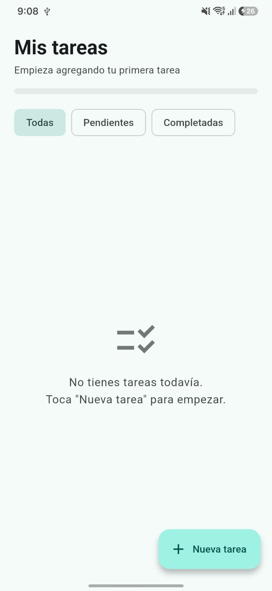

# to_do

Una app de lista de tareas hecha con Flutter: agrega, edita, marca como completadas y elimina tareas, con prioridades, filtros y persistencia local.

## Capturas



## Requisitos

- [Flutter SDK](https://docs.flutter.dev/get-started/install) (canal stable)
- Un emulador/dispositivo Android o iOS, o soporte de escritorio (Linux/macOS/Windows) o Chrome

Verifica tu instalación con:

```bash
flutter doctor
```

## Clonar y ejecutar

```bash
git clone <url-del-repositorio>
cd to_do
flutter pub get
flutter run
```

Si tienes varios dispositivos conectados, elige uno explícitamente:

```bash
flutter devices
flutter run -d <device-id>
```

## Pruebas

```bash
flutter test
```
